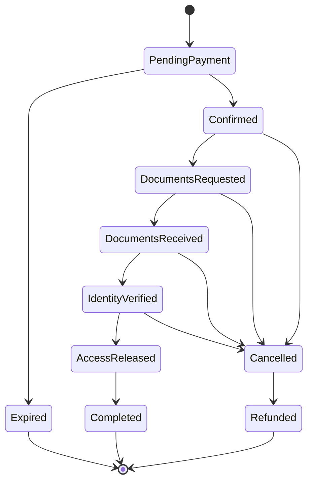

# 01 — Requirements

**Status:** draft v0.2 — output of design phase 1 (updated after phase 2)
**Language:** English (public portfolio repository)

Legend: **(A)** = assumption to be confirmed · **(TBD)** = decision deferred to a later phase.

---

## 1. Purpose and scope

A web application for a small bed & breakfast (2 rooms) that handles:

- presentation of the rooms;
- direct bookings with full online payment (PayPal);
- collection of guest data and documents and identity verification before arrival;
- release of self check-in instructions and access codes;
- contact between guests and host;
- a city blog (post-MVP).

The project is also a secure-by-design reference: design, threat modelling, SAST, DAST / self-pentest and WAF hardening are documented in this repository, step by step.

**Architecture and stack (decided):** monolith, ASP.NET Core with Razor Pages, PostgreSQL, PayPal Orders v2 (server-side), reverse proxy with WAF on a VPS.

---

## 2. Actors

| Actor | Description |
|---|---|
| Visitor | Anonymous user browsing rooms and availability |
| Guest | Visitor who made a booking; no account, no password: access to the booking is via a personal link with a random token |
| Host / Admin | Owner of the B&B, logs in with MFA. One person, possibly one collaborator |
| External systems | PayPal, email provider, Booking / Airbnb calendars (iCal) |

---

## 3. Business rules

### Fixed

| Rule | Value |
|---|---|
| Rooms | 2: one with 5 beds, one with 4 beds |
| Pricing unit | Per room, per night (not per person) |
| Minimum stay | 1 night (e.g. 20th → 21st) |
| Check-in | Self check-in, available 24h, subject to identity verification (see §4 and US-17) |
| Check-out | By 11:00 |
| Children | Allowed |
| Pets | Allowed; a supplement may apply |
| Payment | Full amount paid online at booking time |
| Booking model | Guest checkout, no registration |

### Configurable from the admin panel (values are placeholders for now)

- nightly rate per room and period (seasons, weekends, special periods);
- discounts;
- pet supplement (applied automatically when a pet is declared; may be 0);
- tourist tax: rate per person per night, cap on chargeable nights, exemption rules (guests under a configurable age, residents).

Each night of a stay is priced by its own date: a stay spanning two periods uses both rates. The price applied to a booking is frozen at booking time. The tourist tax is shown as a **separate line** in the price summary and in the payment order.

### Assumptions

- **(A)** One booking can include both rooms, with a single payment.
- **(A)** Currency: EUR.
- **(A)** Site languages: Italian and English.
- **(A)** Dates are put on hold while the guest pays; proposed hold: 15 minutes.

---

## 4. Booking lifecycle

- `PendingPayment`: dates on hold; the booking is confirmed only after the payment has been captured **and verified server-side** (status, amount, currency, order bound to this booking, not already used).
- `IdentityVerified` is set **only by the host**, after receiving the guests' data and documents.
- `AccessReleased`: check-in instructions and codes become visible only if the booking is `IdentityVerified` **and** the current time is inside the release window **(A: from 24h before arrival)**.
- **Guest registration** with the authorities is performed manually by the host on the official portal. It is tracked as a separate event on the booking (`RegistrationSubmittedAt`), not as a lifecycle state (see US-17).
- Cancellation and refund rules per state are defined in design phase 4.

---

## 5. Functional requirements (user stories)

### 5.1 MVP

**Room showcase**

- **US-01** As a visitor, I want to see the list of rooms with photos, amenities, capacity and an indicative price, so that I can choose.
- **US-02** As a visitor, I want a room detail page with an availability calendar.
- **US-03 (A)** As a visitor, I want the site in Italian and English.

**Booking and payment**

- **US-04** As a guest, I want to choose dates and number of people and see availability and the total price before proceeding.
- **US-05** As a guest, I want to enter my details (name, email, phone, expected arrival time, requests), the number of guests, how many of them are under the exemption age, whether any guest is a resident of the city (tourist-tax exemptions), and whether I travel with pets, and accept privacy and cancellation terms. The system validates room capacity (5 and 4) and shows the tourist tax as a separate line.
- **US-06** As a guest, I want to pay the full amount with PayPal (card payment without a PayPal account where available).
- **US-07** As a guest, I want a confirmation email with: booking summary; house rules; check-in and check-out information; directions to the property from Naples airport and from Napoli Centrale station; the link to manage my booking. The email contains **no access codes**.
- **US-08** As a guest, I want to view my booking from my personal link and cancel it according to the refund policy.

**Contact**

- **US-09** As a visitor, I want to write to the host through a contact form (protected against spam and abuse).
- **US-10** As a host, I want to receive the message by email and read it in the admin panel.

**Administration**

- **US-11** As a host, I want to log in to the admin panel with MFA.
- **US-12** As a host, I want to see and manage bookings (list, detail, states) and a **centralised calendar** across platforms showing: free, direct booking, occupied via Booking, occupied via Airbnb, manually blocked, pending payment. **(A)** Synchronisation via iCal import/export with Booking and Airbnb. iCal is not real-time: the residual double-booking window is reduced with frequent polling and short holds.
- **US-13** As a host, I want to manage rooms, descriptions and photos.
- **US-14** As a host, I want to block dates manually (maintenance, bookings received elsewhere).
- **US-15** As a host, I want to refund a booking fully or partially, with an audit log of who did what.
- **US-16** As a host, I want to set room prices per period, discounts, the pet supplement and the tourist-tax parameters from a dedicated admin page. Every change is written to the audit log.
- **US-27** As a host, I want a list of arrivals (today and next days) with the state of each booking: documents missing, documents received, identity verified, registration submitted.

**Guest data, identity verification and access**

- **US-17** Guest data and identity verification.
  - As a guest, I want to fill in, for each person in my group, a form with the personal data required for the guest registration (name, sex, date and place of birth, citizenship, document type and number) and upload a photo of the document, using the link received by email. Upload is **write-only** (no way to view uploaded files).
  - Files are validated, stored encrypted outside the web root, and visible only to the host (MFA, access log).
  - As a host, I want to review the data and photos and set the booking as **identity verified**. The verification method (including any real-time check) is carried out by the host outside the application; the application records the outcome.
  - As a host, after submitting the guest registration manually on the official portal, I want a **"Registration submitted"** action that records timestamp and an optional receipt reference, permanently deletes the document photos and the registration personal data (keeping only the receipt reference) and writes an audit log entry. There is no automatic submission and no integration with the portal.
  - Safety net: if the host does not press the action, photos and registration data are deleted automatically a configurable number of hours after the arrival date (default 48h), with an alert to the host.
- **US-18 (A)** As a guest, I want to receive check-in instructions and access codes only after payment and identity verification, and only inside the release window before arrival. Codes are temporary or rotated at every stay.

**Link recovery**

- **US-19** As a guest who lost my link, I want to receive a new one by entering only my email address. The system always answers with the same message, whether or not a booking exists, and is rate-limited.
- **US-20** As a host, I want to correct the email of a booking, resend links or revoke all links of a booking, with audit log.

**Site information**

- **US-26** As a visitor, I want to see the property's national identification code (CIN) and the business information of the operator in the site footer, on the room pages and in the emails.

### 5.2 Post-MVP

- **US-21** City blog: articles written in Markdown by the host and published from the admin panel.
- **US-22** Discount codes and special rates.
- **US-23** "How to get here" and local guide pages.
- **US-24** Export of revenue reports for accounting.
- **US-25** Newsletter, only with explicit consent.

Each story will receive acceptance criteria, and its abuse cases will be captured in the threat model (phase 6).

---

## 6. Automated emails

**To the guest**

1. Booking confirmation (US-07): summary, rules, directions, management link.
2. Guest data and documents request (US-17): sent after payment, with a personal link to the upload page.
3. Check-in instructions and access codes (US-18): sent only when the booking is verified and inside the release window.
4. **(A)** Reminder if documents are missing N days before arrival (timing TBD).
5. Cancellation / refund confirmation.

**To the host**

- new booking;
- new contact message;
- guest data and documents uploaded by a guest;
- arrivals with verification still missing **(A)**;
- automatic deletion of documents performed by the safety net.

Sender authentication (SPF, DKIM, DMARC) is a deployment requirement.

---

## 7. Design constraints

- **Minimum personal data:** each feature collects only what it needs; details and retention parameters are in [02 — Data classification and retention](02-data-and-retention.md).
- **Documents are ephemeral:** photos of identity documents are kept only until the host has completed the guest registration.
- **Manual operations by design:** identity verification and guest registration are performed by the host; the application supports them with data, states and reminders.
- **Tourist tax:** computed from configurable parameters, shown separately from the stay price.
- **Legal identifiers:** the CIN and the operator's business information are shown on the site (US-26).

---

## 8. Non-functional requirements (high level)

- Mobile-first, responsive UI; accessibility target WCAG 2.1 AA **(A)**; basic SEO.
- Very simple user experience: no registration, no passwords for guests, a progress bar showing the booking state (*paid → documents → verification → instructions*) with a clear indication of what is missing, photo upload from smartphone with progress and explicit confirmation.
- Single VPS: short downtimes are acceptable; backups stored off the server with **tested** restore.
- Security requirements will be derived from OWASP ASVS (level 1 as baseline, level 2 for payments, admin and documents) in design phase 7.

---

## 9. Out of scope

Guest accounts with passwords, mobile app, live chat, full channel manager, payment methods other than PayPal, multiple properties, housekeeping management, automatic integration with external registration portals.

---

## 10. Open decisions

| # | Decision | Phase |
|---|---|---|
| 1 | Pet supplement: per night or per stay | 4 |
| 2 | Cancellation and refund windows; case "paid but identity not verified" | 4 |
| 3 | Date-hold duration (proposed: 15 min) | 3 |
| 4 | Access-release window (proposed: 24h before arrival) | 3 |
| 5 | Reminder timing for missing documents | 3 |
| 6 | OTA platforms in scope (assumed: Booking, Airbnb) | 3 |
| 7 | One booking with both rooms | 3 |

---

## 11. Traceability

Requirements (this document) → data and retention (02) → threat model and abuse cases (phase 6) → security requirements from ASVS (phase 7) → tests and pipeline gates (phase 10).
